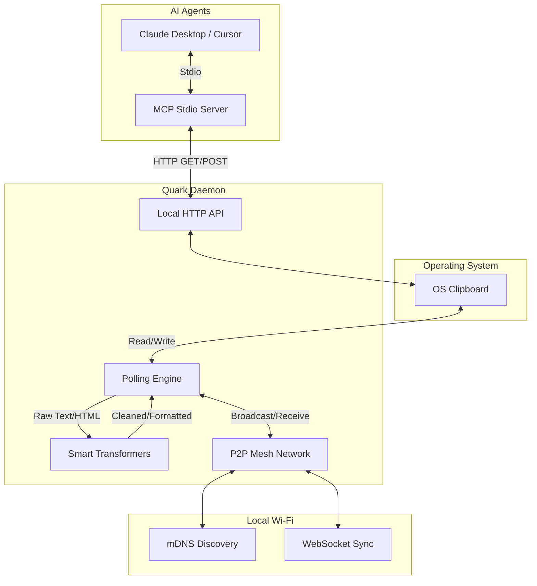

# 🌌 Quark

**The AI-Native, Cross-Platform Clipboard Micro-Daemon.**

© 2026 Adarsh Agrahari. All Rights Reserved.

Quark is a headless, zero-configuration background service that orbits your operating system's clipboard. It silently fixes your copy-paste nightmares, syncs your clipboard across devices seamlessly, and exposes your clipboard directly to local AI models via the Model Context Protocol (MCP).

---

## 🛑 The Problem

The operating system clipboard is fundamentally broken and stuck in the past:
- **Dumb Text:** You copy text from a PDF, and the line breaks shatter.
- **Privacy Leaks:** You copy a link, and tracking tags (`?utm_source=...`) follow you.
- **Lost Formatting:** You copy a table or Markdown, and the formatting vanishes when pasted into an email.
- **Isolation:** You switch to your laptop, and your clipboard is empty.
- **Blind AI:** Your local AI agents (Claude, Cursor) have no native access to what you just copied.

## 💡 The Solution

**Enter Quark.** A silent, zero-configuration daemon that lives in your background. It requires no interface. It simply fixes what is broken.
- **Heals** broken PDF text automatically.
- **Strips** tracking parameters from URLs.
- **Transforms** raw Excel data, Markdown, and LaTeX into clean, rich HTML.
- **Syncs** across your Mac, Windows, and Linux machines instantly via P2P.
- **Exposes** your clipboard to local AI models via MCP.

---

## 🚀 Quick Start

No `.exe` files. No `.dmg` files. Just pure, cross-platform JavaScript.

```bash
# Run instantly without installing (Temporary Session)
npx quark-daemon start

# OR install globally as a background OS service
npm install -g quark-daemon
quark install
```

## 🏗️ Architecture

Quark is built entirely in Node.js to ensure 100% cross-platform compatibility without the need for native C++ compilation.



### Technical Deep Dive
- **Clipboard Engine:** Uses native OS commands (`pbcopy`/`pbpaste` for macOS, `xclip` for Linux, `powershell` and `System.Windows.Forms` for Windows) to read and write both `text/plain` and `text/html` streams simultaneously.
- **Zero-Config Mesh Network:** Uses mDNS (Bonjour/ZeroConf) to broadcast its presence (`quark-clip`). When peers discover each other, they establish direct WebSocket connections. No central server is used.
- **Transformation Pipeline:** A synchronous/asynchronous pipeline that detects content types (Markdown, LaTeX, URLs, TSV) and applies regex heuristics, `marked` parsing, and smart typographic quoting based on language character frequency.

---

## 🤖 Model Context Protocol (MCP)

Quark acts as a bridge between your OS clipboard and local AI models using the [Model Context Protocol](https://modelcontextprotocol.io/).

When you run `quark mcp`, it starts a standard MCP server over `stdio`. This server communicates with the background Quark daemon via a local HTTP API (port `14314`).

### Exposed Tools
1. \`get_clipboard\`: Reads the user's current operating system clipboard.
2. \`set_clipboard\`: Writes text directly to the user's operating system clipboard.

### Claude Desktop Integration
To give Claude Desktop access to your clipboard, add Quark to your `claude_desktop_config.json`:

```json
{
  "mcpServers": {
    "quark": {
      "command": "npx",
      "args": ["quark-daemon", "mcp"]
    }
  }
}
```
*Note: Ensure the Quark daemon is running in the background (`quark start` or `quark install`) for the MCP server to function.*

---

## 🤝 Contributing

Please read `CONTRIBUTING.md` for details on our code of conduct, and the process for submitting pull requests to us.

## 📄 License

This project is licensed under the MIT License - see the `LICENSE` file for details.
